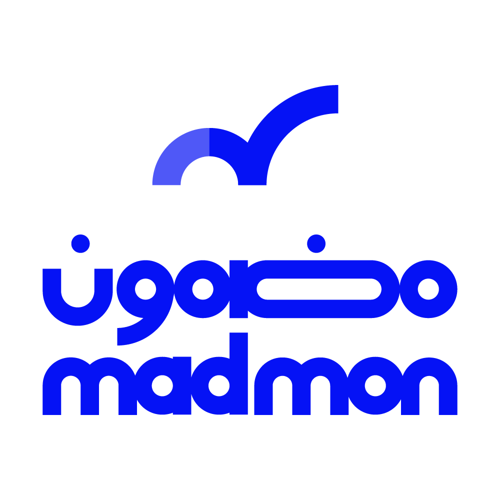

# Omar Mohammed

**Full-Stack Developer** · Software Engineer

 

---

### About

Full-stack developer with 4+ years building production systems end to end — backend architecture through responsive interfaces. I've led and mentored backend teams, built CRMs from scratch, wired up payment and messaging integrations, and spent a lot of time making slow queries fast.

- 💼 **Currently** — Full-Stack Developer at [winch.sa](https://winch.sa), a logistics platform for transport and roadside assistance across Saudi Arabia
- 🎓 **BSc Software Engineering** — Al-Azhar University, GPA 89.3%, First Class Honors
- 🌍 **Languages** — Arabic (native) · English (professional)

---

### Tech Stack

**Backend & Data**

**Frontend**

**Tools & Infrastructure**

 

---

### Live Projects

Platforms I've built and shipped to production.

| | Project | What it is |
|:--:|---|---|
|  | **[winch.sa](https://winch.sa)** | Logistics platform connecting customers with transport and roadside assistance across Saudi Arabia |
|  | **[rental.sa](https://rental.sa)** | Rental marketplace with Moyasar & STC Pay payment integration |
|  | **[musawir.sa](https://musawir.sa)** | Photography services platform with booking and payment flows |
|  | **[Veloura](https://velouraa-eg.com/)** | E-commerce store — full catalog, cart, favorites, and InstaPay checkout |
|  | **[Dan's Trucking](https://danstrucking.com.au/)** | Australian bulk freight company site with a CMS-driven services, fleet, and quote system |
|  | **[madmon.ai](https://madmon.ai)** | Real-estate platform with an internal CRM API supporting 14+ roles and workflows |
|  | **[omarmohammed.cloud](https://omarmohammed.cloud/en)** | My portfolio — built with Laravel |

**Integrations shipped across these:** Moyasar · STC Pay · Fawry · InstaPay · WhatsApp Business (Meta) OTP · SMS gateways · Firebase Cloud Messaging · Telegram Bots · OAuth 2.0 SSO (Microsoft & Google) · GA4 · GTM · Meta Pixel

---

### GitHub Stats

 

  

---

Clean code · User-centered design · Continuous improvement

